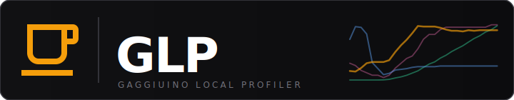

<p align="center">
  
</p>

<p align="center">
  <a href="https://github.com/mxkissnr/gaggiuino-profiler-integration/releases">
    
  </a>
  <a href="https://github.com/custom-components/hacs">
    
  </a>
  
  
  
</p>

<p align="center">
  Exposes <a href="https://github.com/mxkissnr/gaggiuino-local-profiler">Gaggiuino Local Profiler</a> as native Home Assistant entities —<br/>
  machine status, shot data and live brewing state, all without cloud.
</p>

---

## ⚡ Quick Install

<a href="https://my.home-assistant.io/redirect/hacs_repository/?owner=mxkissnr&repository=gaggiuino-profiler-integration&category=integration">
  
</a>

---

## ✨ Features

| | Feature | Description |
|---|---|---|
| ☕ | **Brewing Sensor** | Binary sensor updated every 2 seconds — perfect as automation trigger |
| 📊 | **15 Shot Sensors** | Profile, score, duration, pressure, yield, ratio, dose, coffee, grinder, shots today and more |
| 🔔 | **Shot Event** | Fires `gaggiuino_profiler_shot_completed` with full shot data after every pull |
| ⚙️ | **Configurable** | URL and poll interval adjustable any time via *Settings → Integration → Configure* |
| 🔍 | **Diagnostics** | HA diagnostics export for easy bug reports |

---

## 🚀 Installation

### HACS (recommended)

1. Click the button above — or: HACS → Integrations → ⋮ → **Custom repositories**
2. Add `https://github.com/mxkissnr/gaggiuino-profiler-integration` as **Integration**
3. Search for *Gaggiuino Local Profiler* and install
4. Restart Home Assistant

### Manual

1. Copy `custom_components/gaggiuino_profiler/` into your `config/custom_components/` directory
2. Restart Home Assistant

---

## ⚙️ Setup

1. **Settings → Devices & Services → Add Integration**
2. Search for *Gaggiuino Local Profiler*
3. Enter the URL of your GLP add-on, e.g.:
   ```
   http://homeassistant.local:8099
   ```
   The integration validates the connection immediately.

### Options

**Settings → Devices & Services → Gaggiuino Local Profiler → Configure**

| Option | Default | Description |
|---|---|---|
| URL | *(entered URL)* | URL of the GLP add-on |
| Poll interval | `60` | Update interval in seconds (10–300) |

---

## 📋 Entities

### Sensors

| Entity | Description | Unit |
|---|---|---|
| Machine Status | `online` / `error` | — |
| Shot Count | Total number of stored shots | shots |
| Shots Today | Number of shots pulled today | shots |
| Last Shot Profile | Extraction profile name | — |
| Last Shot Score | Automatic 0–100 score | — |
| Last Shot Date | Timestamp of the last shot | — |
| Last Shot Duration | Shot duration | s |
| Last Shot Avg Pressure | Average extraction pressure | bar |
| Last Shot Yield | Output weight | g |
| Last Shot Brew Ratio | Yield ÷ dose | — |
| Last Shot Dose | Input dose weight | g |
| Last Shot Coffee | Coffee annotation | — |
| Last Shot Grinder | Grinder annotation | — |
| Last Sync | Timestamp of last sync | — |
| Machine Hostname | Gaggiuino controller hostname | — |

### Binary Sensor

| Entity | Description | Update rate |
|---|---|---|
| Brewing | `true` during an active pull | every 2 seconds |

---

## 🔔 Event: `gaggiuino_profiler_shot_completed`

Fired automatically after every completed pull. Contains all relevant shot data:

```yaml
event_type: gaggiuino_profiler_shot_completed
data:
  shot_id: 54
  profile: "Adaptive"
  duration_s: 28.4
  yield_g: 42.1
  dose_g: 18.0
  ratio: 2.34
  avg_pressure: 8.72
  score: 87
  coffee: "Ethiopia Yirgacheffe"
  grinder: "DF64"
```

### Automation examples

**Notification after each shot:**
```yaml
automation:
  trigger:
    platform: event
    event_type: gaggiuino_profiler_shot_completed
  action:
    service: notify.mobile_app
    data:
      title: "☕ Shot done"
      message: >
        {{ trigger.event.data.profile }} –
        {{ trigger.event.data.duration_s }}s,
        ratio 1:{{ trigger.event.data.ratio }}
```

**Dim lights when brewing ends:**
```yaml
automation:
  trigger:
    platform: state
    entity_id: binary_sensor.gaggiuino_local_profiler_brewing
    from: "on"
    to: "off"
  action:
    service: light.turn_on
    target:
      entity_id: light.kitchen
    data:
      brightness_pct: 30
```

---

## 🏗️ Architecture

```
Home Assistant
├── GlpDataCoordinator  (60 s, configurable)
│   ├── GET /api/status    → machine status, shotCount, lastSync
│   └── GET /shots.json    → shot data, annotations, datapoints
│
├── GlpLiveCoordinator  (2 s)
│   └── GET /api/live/data → isLive (brewing state)
│
└── Event Bus
    └── gaggiuino_profiler_shot_completed  (on new shot_id)
```

---

## 🔍 Diagnostics

**Settings → Devices & Services → Gaggiuino Local Profiler → Device → Download Diagnostics**

The diagnostics file contains current coordinator data (no sensitive information) and makes it easy to file an issue.

---

<p align="center">
  <a href="CHANGELOG.md">📋 Changelog</a> ·
  <a href="DOCS.de.md">📖 Dokumentation (DE)</a> ·
  <a href="https://github.com/mxkissnr/gaggiuino-local-profiler">🔧 GLP Add-on</a> ·
  <a href="https://github.com/mxkissnr/gaggiuino-profiler-integration/issues">🐛 Issues</a>
</p>

<p align="center">
  <sub>Built with AI assistance — designed and developed together with <a href="https://claude.ai">Claude</a> by Anthropic</sub>
</p>
